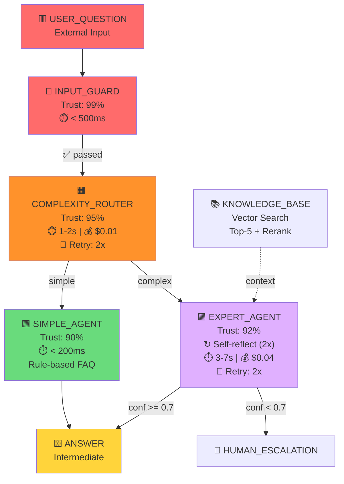

# AWN Workflow Pipeline - Полный Цикл Разработки

**От идеи до production за 7 этапов**

---

## 📋 Оглавление

1. [Быстрый старт (5 минут)](#быстрый-старт)
2. [Полный пайплайн (7 этапов)](#полный-пайплайн)
3. [Инструменты и toolchain](#инструменты)
4. [Best Practices](#best-practices)
5. [Примеры использования](#примеры)

---

## Быстрый старт

### Минимальный workflow (5 минут):

```bash
# 1. Создать YAML спецификацию
cat > my-workflow.yaml << 'EOF'
workflow:
  name: "Hello Agent"
  version: "1.0.0"
  
  nodes:
    - id: "INPUT"
      type: "data"
      category: "external_input"
      color: "red"
    
    - id: "AGENT"
      type: "llm_agent"
      color: "purple"
      trust_score: 0.85
      llm_model: "gemini-2.0-flash"
      temperature: 0.3
      system_prompt: "You are a helpful assistant."
    
    - id: "OUTPUT"
      type: "data"
      category: "intermediate"
      color: "yellow"
  
  edges:
    - from: "INPUT"
      to: "AGENT"
      type: "data_flow"
    
    - from: "AGENT"
      to: "OUTPUT"
      type: "data_flow"
EOF

# 2. Валидировать
awn validate my-workflow.yaml

# 3. Визуализировать
awn visualize my-workflow.yaml --format mermaid > diagram.md

# 4. Сгенерировать код
awn generate my-workflow.yaml --target adk --output ./generated/

# 5. Запустить
cd generated && python main.py
```

---

## Полный пайплайн

```
┌──────────────┐
│ 1. Design    │ → Проектирование архитектуры
└──────┬───────┘
       ↓
┌──────────────┐
│ 2. Specify   │ → Написание YAML спецификации
└──────┬───────┘
       ↓
┌──────────────┐
│ 3. Validate  │ → Валидация и проверка
└──────┬───────┘
       ↓
┌──────────────┐
│ 4. Visualize │ → Диаграммы и документация
└──────┬───────┘
       ↓
┌──────────────┐
│ 5. Generate  │ → Генерация кода
└──────┬───────┘
       ↓
┌──────────────┐
│ 6. Test      │ → Тестирование
└──────┬───────┘
       ↓
┌──────────────┐
│ 7. Deploy    │ → Деплой и мониторинг
└──────────────┘
```

---

## Этап 1: Design (Проектирование) 🎨

### Что делаем:
- Анализируем требования
- Выбираем паттерны из каталога
- Набрасываем архитектуру

### Инструменты:
- `PATTERN-CATALOG.md` - библиотека паттернов
- Whiteboard / Figma для набросков
- Miro для коллаборации

### Чеклист:
- [ ] Определены входы и выходы
- [ ] Выбраны типы агентов
- [ ] Определена стратегия collaboration (если multi-agent)
- [ ] Определены точки failure handling
- [ ] Оценена стоимость (LLM calls)

### Пример процесса:

```
Задача: "Система поддержки с автоматическим ответом"

1. Анализ:
   - Входы: вопросы пользователей (text)
   - Выходы: ответы (text)
   - Сложность: переменная (простые FAQ vs сложные техподдержка)

2. Выбор паттернов:
   - Pattern 6.1: Conditional Router (для разделения простых/сложных)
   - Pattern 1.3: RAG + Expert (для сложных вопросов)
   - Pattern 5.1: Input Guardrails (безопасность)
   - Pattern 4.3: Fallback Chain (надёжность)

3. Набросок архитектуры:
   INPUT → GUARDRAIL → ROUTER → {SIMPLE | EXPERT+RAG} → OUTPUT
```

### Документ дизайна:

```markdown
# Design Doc: Support System

## Architecture
- Conditional routing based on complexity
- Simple: Rule-based FAQ matcher
- Complex: RAG + LLM Expert
- Guardrails: PII + toxicity check

## Agents
1. INPUT_GUARD (guardrail, trust=0.99)
2. ROUTER (orchestrator, trust=0.95)
3. SIMPLE_AGENT (rule-based, trust=0.90)
4. RAG (retrieval_system)
5. EXPERT_AGENT (llm, trust=0.92)

## SLA
- Response time: < 5s (simple), < 10s (complex)
- Cost: < $0.05 per request
- Availability: 99.9%
```

---

## Этап 2: Specify (Спецификация) 📝

### Что делаем:
- Пишем YAML спецификацию по AWN v2.0
- Используем IDE с поддержкой JSON Schema
- Заполняем все обязательные поля

### Инструменты:
- **VS Code** + YAML extension + JSON Schema
- **IntelliJ IDEA** + YAML plugin
- Онлайн валидатор (опционально)

### Настройка VS Code:

```json
// .vscode/settings.json
{
  "yaml.schemas": {
    "./awn-schema-v2.0.json": "*.awn.yaml"
  },
  "yaml.format.enable": true,
  "yaml.validate": true
}
```

### Пишем спецификацию:

```yaml
# support-workflow.awn.yaml
workflow:
  name: "Intelligent Support System"
  version: "1.0.0"
  description: "Auto-respond to user questions with guardrails"
  
  # Observability
  observability:
    enabled: true
    provider: "agentops"
    tracing:
      emit_spans: true
      include_prompts: true
    metrics:
      - name: "end_to_end_latency"
        threshold: "< 10s"
        alert: true
      - name: "cost_per_request"
        threshold: "< $0.05"
        alert: true
  
  # Global settings
  settings:
    max_total_iterations: 5
    global_timeout: "30s"
    cost_limit: "$1.00"
  
  nodes:
    # Data nodes
    - id: "USER_QUESTION"
      type: "data"
      category: "external_input"
      color: "red"
      description: "User's question"
      schema:
        type: "object"
        properties:
          text:
            type: "string"
            minLength: 3
          user_id:
            type: "string"
        required: ["text"]
    
    # Guardrail
    - id: "INPUT_GUARD"
      type: "guardrail_agent"
      color: "red"
      trust_score: 0.99
      description: "Check for PII, toxicity, prompt injection"
      checks:
        - "pii_detection"
        - "prompt_injection"
        - "toxicity_filter"
      on_violation: "reject"
      performance:
        expected_latency: "< 500ms"
        max_latency: "1s"
    
    # Router
    - id: "COMPLEXITY_ROUTER"
      type: "router_agent"
      color: "orange"
      trust_score: 0.95
      description: "Route based on question complexity"
      routing_rules:
        - condition: "complexity < 0.5"
          target: "SIMPLE_AGENT"
          priority: 1
        - condition: "complexity >= 0.5"
          target: "EXPERT_AGENT"
          priority: 2
      default_route: "SIMPLE_AGENT"
      performance:
        expected_latency: "1-2s"
      cost:
        estimated_per_call: "$0.01"
      failure_handling:
        retry:
          enabled: true
          max_attempts: 2
          backoff: "linear"
          delay: "500ms"
    
    # Simple FAQ agent
    - id: "SIMPLE_AGENT"
      type: "rule_based_agent"
      color: "green"
      trust_score: 0.90
      description: "Handle FAQ with templates"
      rules:
        - id: "password_reset"
          condition: "contains('password') OR contains('login')"
          action: "return_template('password_reset_instructions')"
        - id: "billing"
          condition: "contains('bill') OR contains('payment')"
          action: "return_template('billing_info')"
      performance:
        expected_latency: "< 200ms"
    
    # RAG system
    - id: "KNOWLEDGE_BASE"
      type: "retrieval_system"
      color: "lightblue"
      description: "Vector search in documentation"
      vector_store: "chroma"
      embedding_model: "text-embedding-004"
      top_k: 5
      reranking: true
      reranking_model: "rerank-v2"
    
    # Expert LLM agent
    - id: "EXPERT_AGENT"
      type: "llm_agent"
      color: "purple"
      trust_score: 0.92
      description: "Handle complex questions with RAG context"
      llm_model: "gemini-2.0-flash"
      temperature: 0.2
      max_tokens: 1000
      system_prompt: |
        You are a customer support expert.
        Use the provided context from the knowledge base to answer accurately.
        If you don't know, admit it and suggest escalation.
        Be concise and helpful.
      output_confidence: true
      confidence_threshold: 0.7
      reflection:
        strategy: "self_reflection"
        max_iterations: 2
        improvement_threshold: 0.1
      performance:
        expected_latency: "3-7s"
        max_latency: "10s"
      cost:
        estimated_per_call: "$0.04"
      failure_handling:
        retry:
          enabled: true
          max_attempts: 2
          backoff: "exponential"
          delay: "1s"
        fallback:
          agent: "SIMPLE_AGENT"
          on_conditions: ["timeout", "error"]
    
    # Output
    - id: "ANSWER"
      type: "data"
      category: "intermediate"
      color: "yellow"
      description: "Final answer to user"
  
  edges:
    # Input validation
    - from: "USER_QUESTION"
      to: "INPUT_GUARD"
      type: "data_flow"
      order: 0
    
    # Route to complexity router
    - from: "INPUT_GUARD"
      to: "COMPLEXITY_ROUTER"
      type: "data_flow"
      order: 1
      condition: "passed == true"
    
    # Route to simple or expert
    - from: "COMPLEXITY_ROUTER"
      to: "SIMPLE_AGENT"
      type: "control_flow"
      condition: "route == 'SIMPLE_AGENT'"
    
    - from: "COMPLEXITY_ROUTER"
      to: "EXPERT_AGENT"
      type: "control_flow"
      condition: "route == 'EXPERT_AGENT'"
    
    # RAG context injection
    - from: "KNOWLEDGE_BASE"
      to: "EXPERT_AGENT"
      type: "context_injection"
    
    # Collect answers
    - from: "SIMPLE_AGENT"
      to: "ANSWER"
      type: "data_flow"
    
    - from: "EXPERT_AGENT"
      to: "ANSWER"
      type: "data_flow"
      condition: "confidence >= 0.7"
    
    # Low confidence escalation
    - from: "EXPERT_AGENT"
      to: "HUMAN_ESCALATION"
      type: "data_flow"
      condition: "confidence < 0.7"
```

### Полезные сниппеты для VS Code:

```json
// .vscode/awn.code-snippets
{
  "AWN Workflow": {
    "prefix": "awn-workflow",
    "body": [
      "workflow:",
      "  name: \"${1:Workflow Name}\"",
      "  version: \"${2:1.0.0}\"",
      "  description: \"${3:Description}\"",
      "  ",
      "  nodes:",
      "    - id: \"${4:NODE_ID}\"",
      "      type: \"${5|llm_agent,rule_based_agent,data,retrieval_system|}\"",
      "  ",
      "  edges:",
      "    - from: \"${6:FROM}\"",
      "      to: \"${7:TO}\"",
      "      type: \"data_flow\""
    ]
  },
  "AWN LLM Agent": {
    "prefix": "awn-llm",
    "body": [
      "- id: \"${1:AGENT_ID}\"",
      "  type: \"llm_agent\"",
      "  color: \"purple\"",
      "  trust_score: ${2:0.85}",
      "  llm_model: \"${3:gemini-2.0-flash}\"",
      "  temperature: ${4:0.3}",
      "  system_prompt: |",
      "    ${5:System prompt here}"
    ]
  }
}
```

---

## Этап 3: Validate (Валидация) ✅

### Что делаем:
- Проверяем YAML на соответствие схеме
- Проверяем логику (нет циклов, все ссылки валидны)
- Проверяем best practices

### Инструменты:

#### 3.1 JSON Schema валидация

```bash
# Установить валидатор
npm install -g ajv-cli

# Валидировать
ajv validate -s awn-schema-v2.0.json -d support-workflow.awn.yaml
```

#### 3.2 AWN CLI (предполагаемый инструмент)

```bash
# Базовая валидация
awn validate support-workflow.awn.yaml

# Verbose режим с предупреждениями
awn validate support-workflow.awn.yaml --verbose

# Проверить конкретный уровень конформности
awn validate support-workflow.awn.yaml --level 2

# Вывод:
# ✅ Schema validation: PASSED
# ✅ Structural validation: PASSED
#   - All node IDs unique
#   - All edge references valid
#   - No self-loops (except feedback)
#   - DAG structure verified
# ✅ Semantic validation: PASSED
#   - Trust scores in range
#   - Confidence thresholds valid
#   - Reflection critics exist
# ⚠️  Warnings:
#   - Node EXPERT_AGENT: No observability configured
#   - Edge from ROUTER: Consider adding fallback
# 
# Conformance Level: 2 (Extended Conformance)
# Ready for deployment: YES
```

#### 3.3 Линтер (Best Practices)

```bash
awn lint support-workflow.awn.yaml

# Вывод:
# 💡 Suggestions:
#   - Consider adding circuit breaker to EXPERT_AGENT
#   - Missing cost tracking for SIMPLE_AGENT
#   - Recommend checkpointing for long workflow
#   - Fan-out width is 2, consider if parallelization helps
# 
# Security:
#   ✅ Guardrails present
#   ✅ PII detection enabled
# 
# Performance:
#   ⚠️  EXPERT_AGENT latency might exceed 10s
#   💡 Consider caching frequent queries
# 
# Cost:
#   Estimated: $0.05 per request (within budget)
```

### Валидация в CI/CD

```yaml
# .github/workflows/validate-awn.yml
name: Validate AWN Specs

on:
  pull_request:
    paths:
      - '**/*.awn.yaml'

jobs:
  validate:
    runs-on: ubuntu-latest
    steps:
      - uses: actions/checkout@v3
      
      - name: Setup AWN CLI
        run: npm install -g @awn/cli
      
      - name: Validate all specs
        run: |
          for file in **/*.awn.yaml; do
            echo "Validating $file..."
            awn validate "$file" --level 2 || exit 1
          done
      
      - name: Lint
        run: |
          for file in **/*.awn.yaml; do
            awn lint "$file"
          done
```

---

## Этап 4: Visualize (Визуализация) 📊

### Что делаем:
- Генерируем диаграммы
- Создаём документацию
- Делаем презентации

### 4.1 Mermaid диаграмма

```bash
# Генерация Mermaid
awn visualize support-workflow.awn.yaml --format mermaid > docs/architecture.md

# Результат в architecture.md:
```



### 4.2 D2 диаграмма (для сложных случаев)

```bash
# Генерация D2
awn visualize support-workflow.awn.yaml --format d2 > docs/architecture.d2

# Компиляция в SVG
d2 docs/architecture.d2 docs/architecture.svg

# Интерактивная версия
d2 --watch docs/architecture.d2
```

### 4.3 Документация

```bash
# Генерация Markdown документации
awn document support-workflow.awn.yaml --output docs/

# Создаёт:
# docs/
#   ├── README.md (общее описание)
#   ├── nodes.md (описание всех узлов)
#   ├── edges.md (описание связей)
#   ├── patterns.md (использованные паттерны)
#   ├── metrics.md (метрики и SLA)
#   └── architecture.md (диаграммы)
```

### 4.4 Интерактивная визуализация

```bash
# Запуск web-интерфейса
awn serve support-workflow.awn.yaml --port 3000

# Открывается http://localhost:3000 с:
# - Интерактивной диаграммой (zoom, pan, click)
# - Деталями каждого узла
# - Метриками (если запущено)
# - Трейсами (если observability включен)
```

---

## Этап 5: Generate (Генерация кода) ⚙️

### Что делаем:
- Генерируем исполняемый код
- Выбираем целевой фреймворк
- Получаем готовый проект

### 5.1 Генерация для Google ADK

```bash
# Генерация Python проекта
awn generate support-workflow.awn.yaml \
  --target adk \
  --language python \
  --output ./support-system-adk/

# Создаётся структура:
# support-system-adk/
#   ├── agents/
#   │   ├── __init__.py
#   │   ├── input_guard.py
#   │   ├── complexity_router.py
#   │   ├── simple_agent.py
#   │   ├── expert_agent.py
#   │   └── knowledge_base.py
#   ├── workflows/
#   │   └── support_workflow.py
#   ├── config/
#   │   └── config.yaml
#   ├── requirements.txt
#   ├── main.py
#   └── README.md
```

**Сгенерированный код (пример):**

```python
# agents/expert_agent.py (сгенерировано из YAML)
from google import genai
from google.genai import types

class ExpertAgent:
    """
    Handle complex questions with RAG context
    
    Trust Score: 0.92
    Expected Latency: 3-7s
    Max Latency: 10s
    Cost: $0.04 per call
    """
    
    def __init__(self):
        self.client = genai.Client()
        self.model = "gemini-2.0-flash"
        self.temperature = 0.2
        self.max_tokens = 1000
        self.trust_score = 0.92
        self.confidence_threshold = 0.7
        
        # Reflection settings
        self.reflection_enabled = True
        self.max_reflection_iterations = 2
        self.improvement_threshold = 0.1
        
        # Failure handling
        self.max_retries = 2
        self.retry_backoff = "exponential"
        self.fallback_agent = "SIMPLE_AGENT"
    
    async def process(self, question: str, context: list[str]) -> dict:
        """Process question with RAG context"""
        
        # Build prompt with context
        context_text = "\n".join([f"- {c}" for c in context])
        prompt = f"""Context from knowledge base:
{context_text}

User question: {question}

Answer accurately using the context. If unsure, admit it."""
        
        # Initial generation
        response = await self._generate_with_retry(prompt)
        
        # Self-reflection if enabled
        if self.reflection_enabled:
            response = await self._self_reflect(question, response)
        
        return {
            "answer": response["text"],
            "confidence": response["confidence"],
            "requires_escalation": response["confidence"] < self.confidence_threshold
        }
    
    async def _generate_with_retry(self, prompt: str) -> dict:
        """Generate with exponential backoff retry"""
        for attempt in range(self.max_retries + 1):
            try:
                response = await self.client.models.generate_content(
                    model=self.model,
                    contents=prompt,
                    config=types.GenerateContentConfig(
                        temperature=self.temperature,
                        max_output_tokens=self.max_tokens
                    )
                )
                
                # Extract confidence (from model or heuristic)
                confidence = self._calculate_confidence(response)
                
                return {
                    "text": response.text,
                    "confidence": confidence
                }
            
            except Exception as e:
                if attempt == self.max_retries:
                    # Fallback to simple agent
                    return await self._fallback(prompt)
                
                # Exponential backoff
                await asyncio.sleep(2 ** attempt)
        
    async def _self_reflect(self, question: str, initial_response: dict) -> dict:
        """Iteratively improve response through self-critique"""
        current = initial_response
        
        for iteration in range(self.max_reflection_iterations):
            # Generate critique
            critique_prompt = f"""Review this answer:
Question: {question}
Answer: {current['text']}

Critique: What could be improved? Be specific."""
            
            critique = await self._generate(critique_prompt)
            
            # Improve based on critique
            improve_prompt = f"""Improve this answer based on critique:
Question: {question}
Previous answer: {current['text']}
Critique: {critique['text']}

Improved answer:"""
            
            improved = await self._generate(improve_prompt)
            
            # Check if improvement significant
            improvement = improved['confidence'] - current['confidence']
            if improvement < self.improvement_threshold:
                break
            
            current = improved
        
        return current
    
    async def _fallback(self, prompt: str) -> dict:
        """Fallback to simpler agent"""
        # Delegate to SIMPLE_AGENT
        from .simple_agent import SimpleAgent
        simple = SimpleAgent()
        return await simple.process(prompt)
```

### 5.2 Генерация для LangGraph

```bash
# Генерация для LangGraph
awn generate support-workflow.awn.yaml \
  --target langgraph \
  --language python \
  --output ./support-system-langgraph/
```

**Сгенерированный LangGraph код:**

```python
# workflow.py (сгенерировано)
from langgraph.graph import StateGraph, END
from typing import TypedDict, Annotated

class SupportState(TypedDict):
    question: str
    complexity: float
    route: str
    rag_context: list[str]
    answer: str
    confidence: float
    requires_escalation: bool

# Build graph
workflow = StateGraph(SupportState)

# Add nodes (generated from AWN nodes)
workflow.add_node("input_guard", input_guard_node)
workflow.add_node("complexity_router", complexity_router_node)
workflow.add_node("simple_agent", simple_agent_node)
workflow.add_node("expert_agent", expert_agent_node)
workflow.add_node("knowledge_base", knowledge_base_node)

# Add edges (generated from AWN edges)
workflow.add_edge("input_guard", "complexity_router")

workflow.add_conditional_edges(
    "complexity_router",
    lambda state: state["route"],
    {
        "SIMPLE_AGENT": "simple_agent",
        "EXPERT_AGENT": "expert_agent"
    }
)

workflow.add_edge("knowledge_base", "expert_agent")
workflow.add_edge("simple_agent", END)

workflow.add_conditional_edges(
    "expert_agent",
    lambda state: "escalate" if state["requires_escalation"] else "end",
    {
        "end": END,
        "escalate": "human_escalation"
    }
)

# Compile
app = workflow.compile()
```

### 5.3 Генерация для других фреймворков

```bash
# Для Semantic Kernel
awn generate workflow.awn.yaml --target semantic-kernel --language csharp

# Для AutoGen
awn generate workflow.awn.yaml --target autogen --language python

# Для CrewAI
awn generate workflow.awn.yaml --target crewai --language python

# Custom template
awn generate workflow.awn.yaml --template ./my-template/ --output ./custom/
```

---

## Этап 6: Test (Тестирование) 🧪

### Что делаем:
- Unit тесты для агентов
- Integration тесты для workflow
- Load тесты для производительности
- Cost тесты для бюджета

### 6.1 Unit тесты

```python
# tests/test_expert_agent.py (можно сгенерировать)
import pytest
from agents.expert_agent import ExpertAgent

class TestExpertAgent:
    @pytest.fixture
    def agent(self):
        return ExpertAgent()
    
    @pytest.mark.asyncio
    async def test_basic_question(self, agent):
        """Test basic question processing"""
        context = ["Password reset: go to /forgot-password"]
        result = await agent.process(
            "How do I reset password?",
            context
        )
        
        assert result["answer"] is not None
        assert result["confidence"] >= 0.0
        assert result["confidence"] <= 1.0
    
    @pytest.mark.asyncio
    async def test_self_reflection(self, agent):
        """Test that self-reflection improves output"""
        context = ["Complex technical info..."]
        
        # Without reflection
        agent.reflection_enabled = False
        result_no_reflect = await agent.process("Complex question", context)
        
        # With reflection
        agent.reflection_enabled = True
        result_reflect = await agent.process("Complex question", context)
        
        # Confidence should improve
        assert result_reflect["confidence"] >= result_no_reflect["confidence"]
    
    @pytest.mark.asyncio
    async def test_low_confidence_escalation(self, agent):
        """Test escalation when confidence low"""
        result = await agent.process("Extremely ambiguous question?", [])
        
        if result["confidence"] < 0.7:
            assert result["requires_escalation"] is True
```

### 6.2 Integration тесты

```python
# tests/test_workflow_integration.py
import pytest
from workflows.support_workflow import SupportWorkflow

class TestSupportWorkflow:
    @pytest.fixture
    def workflow(self):
        return SupportWorkflow()
    
    @pytest.mark.asyncio
    async def test_simple_question_flow(self, workflow):
        """Test that simple questions route correctly"""
        result = await workflow.run({
            "question": "How do I reset my password?"
        })
        
        # Should go through SIMPLE_AGENT
        assert result["route"] == "SIMPLE_AGENT"
        assert result["latency"] < 1.0  # < 1s for simple
        assert result["answer"] is not None
    
    @pytest.mark.asyncio
    async def test_complex_question_flow(self, workflow):
        """Test complex question with RAG"""
        result = await workflow.run({
            "question": "Explain the architecture of your authentication system"
        })
        
        # Should go through EXPERT_AGENT with RAG
        assert result["route"] == "EXPERT_AGENT"
        assert result["rag_context"] is not None
        assert len(result["rag_context"]) > 0
        assert result["latency"] < 10.0  # < 10s per SLA
    
    @pytest.mark.asyncio
    async def test_guardrail_rejection(self, workflow):
        """Test that guardrails block bad input"""
        result = await workflow.run({
            "question": "My SSN is 123-45-6789, please help"  # Contains PII
        })
        
        assert result["status"] == "rejected"
        assert "PII detected" in result["reason"]
```

### 6.3 Load тесты

```python
# tests/load_test.py
import asyncio
from locust import HttpUser, task, between

class SupportWorkflowUser(HttpUser):
    wait_time = between(1, 3)
    
    @task
    def ask_simple_question(self):
        self.client.post("/api/ask", json={
            "question": "How do I reset password?"
        })
    
    @task(2)  # 2x more frequent
    def ask_complex_question(self):
        self.client.post("/api/ask", json={
            "question": "Explain your authentication flow"
        })

# Run:
# locust -f tests/load_test.py --users 100 --spawn-rate 10
```

### 6.4 Cost тесты

```python
# tests/test_cost.py
import pytest
from workflows.support_workflow import SupportWorkflow

class TestCost:
    @pytest.mark.asyncio
    async def test_cost_per_request_within_budget(self):
        """Ensure cost per request < $0.05"""
        workflow = SupportWorkflow()
        
        # Run 100 diverse questions
        total_cost = 0
        for i in range(100):
            result = await workflow.run({
                "question": f"Test question {i}"
            })
            total_cost += result["cost"]
        
        avg_cost = total_cost / 100
        assert avg_cost < 0.05, f"Cost ${avg_cost} exceeds budget $0.05"
    
    @pytest.mark.asyncio
    async def test_fallback_reduces_cost(self):
        """Ensure fallback chain reduces cost"""
        workflow = SupportWorkflow()
        
        # Simulate primary failure -> fallback to cheaper
        result = await workflow.run({
            "question": "Test",
            "_force_primary_failure": True  # Test hook
        })
        
        # Should use cheaper fallback
        assert result["agent_used"] == "SIMPLE_AGENT"
        assert result["cost"] < 0.01  # Much cheaper
```

---

## Этап 7: Deploy (Деплой и мониторинг) 🚀

### Что делаем:
- Деплоим в production
- Настраиваем мониторинг
- Настраиваем алерты
- Continuous monitoring

### 7.1 Deployment

#### Docker

```dockerfile
# Dockerfile (можно сгенерировать)
FROM python:3.11-slim

WORKDIR /app

# Install dependencies
COPY requirements.txt .
RUN pip install --no-cache-dir -r requirements.txt

# Copy application
COPY . .

# Expose port
EXPOSE 8000

# Health check
HEALTHCHECK --interval=30s --timeout=3s --start-period=5s --retries=3 \
  CMD curl -f http://localhost:8000/health || exit 1

# Run
CMD ["uvicorn", "main:app", "--host", "0.0.0.0", "--port", "8000"]
```

```bash
# Build and run
docker build -t support-system:v1.0 .
docker run -d -p 8000:8000 \
  -e GEMINI_API_KEY=$GEMINI_API_KEY \
  -e OBSERVABILITY_ENDPOINT=$AGENTOPS_ENDPOINT \
  support-system:v1.0
```

#### Kubernetes

```yaml
# k8s/deployment.yaml (можно сгенерировать)
apiVersion: apps/v1
kind: Deployment
metadata:
  name: support-system
  labels:
    app: support-system
    version: v1.0
spec:
  replicas: 3
  selector:
    matchLabels:
      app: support-system
  template:
    metadata:
      labels:
        app: support-system
      annotations:
        # Observability annotations
        prometheus.io/scrape: "true"
        prometheus.io/port: "9090"
    spec:
      containers:
      - name: support-system
        image: support-system:v1.0
        ports:
        - containerPort: 8000
        env:
        - name: GEMINI_API_KEY
          valueFrom:
            secretKeyRef:
              name: api-keys
              key: gemini
        resources:
          requests:
            memory: "256Mi"
            cpu: "250m"
          limits:
            memory: "512Mi"
            cpu: "500m"
        livenessProbe:
          httpGet:
            path: /health
            port: 8000
          initialDelaySeconds: 30
          periodSeconds: 10
        readinessProbe:
          httpGet:
            path: /ready
            port: 8000
          initialDelaySeconds: 5
          periodSeconds: 5
---
apiVersion: v1
kind: Service
metadata:
  name: support-system
spec:
  selector:
    app: support-system
  ports:
  - port: 80
    targetPort: 8000
  type: LoadBalancer
```

```bash
# Deploy
kubectl apply -f k8s/deployment.yaml

# Check status
kubectl get pods -l app=support-system
kubectl logs -f deployment/support-system
```

### 7.2 Observability Setup

#### AgentOps Integration

```python
# main.py (с observability из AWN)
from agentops import AgentOps
import os

# Initialize from AWN config
agentops = AgentOps(
    api_key=os.getenv("AGENTOPS_API_KEY"),
    config={
        "emit_spans": True,
        "include_prompts": True,
        "include_outputs": True
    }
)

# Wrap workflow
@agentops.trace_workflow("support-system")
async def handle_request(question: str):
    workflow = SupportWorkflow()
    result = await workflow.run({"question": question})
    return result
```

#### Prometheus Metrics

```python
# metrics.py (сгенерировано из AWN observability)
from prometheus_client import Counter, Histogram, Gauge

# Metrics defined in AWN
end_to_end_latency = Histogram(
    'workflow_latency_seconds',
    'End-to-end workflow latency',
    buckets=[0.1, 0.5, 1, 2, 5, 10, 30]
)

cost_per_request = Histogram(
    'workflow_cost_dollars',
    'Cost per request in dollars',
    buckets=[0.001, 0.01, 0.05, 0.1, 0.5]
)

confidence_score = Histogram(
    'agent_confidence',
    'Agent output confidence',
    ['agent_id'],
    buckets=[0.1, 0.3, 0.5, 0.7, 0.8, 0.9, 1.0]
)

requests_total = Counter(
    'workflow_requests_total',
    'Total requests',
    ['route', 'status']
)

active_requests = Gauge(
    'workflow_active_requests',
    'Currently active requests'
)
```

#### Grafana Dashboard

```json
// grafana-dashboard.json (можно сгенерировать из AWN metrics)
{
  "dashboard": {
    "title": "Support System - AWN Monitoring",
    "panels": [
      {
        "title": "Latency (P50, P95, P99)",
        "targets": [
          {
            "expr": "histogram_quantile(0.50, workflow_latency_seconds_bucket)",
            "legendFormat": "P50"
          },
          {
            "expr": "histogram_quantile(0.95, workflow_latency_seconds_bucket)",
            "legendFormat": "P95"
          },
          {
            "expr": "histogram_quantile(0.99, workflow_latency_seconds_bucket)",
            "legendFormat": "P99"
          }
        ],
        "alert": {
          "conditions": [
            {
              "query": "histogram_quantile(0.95, workflow_latency_seconds_bucket) > 10",
              "message": "P95 latency exceeds SLA (10s)"
            }
          ]
        }
      },
      {
        "title": "Cost per Request",
        "targets": [
          {
            "expr": "rate(workflow_cost_dollars_sum[5m]) / rate(workflow_cost_dollars_count[5m])"
          }
        ],
        "alert": {
          "conditions": [
            {
              "query": "avg_cost > 0.05",
              "message": "Cost exceeds budget ($0.05)"
            }
          ]
        }
      },
      {
        "title": "Agent Confidence Distribution",
        "targets": [
          {
            "expr": "histogram_quantile(0.50, agent_confidence_bucket{agent_id='EXPERT_AGENT'})"
          }
        ]
      },
      {
        "title": "Route Distribution",
        "targets": [
          {
            "expr": "sum by(route) (rate(workflow_requests_total[5m]))"
          }
        ]
      }
    ]
  }
}
```

### 7.3 Alerting

```yaml
# alerts.yaml (можно сгенерировать из AWN)
groups:
  - name: support_system_alerts
    interval: 30s
    rules:
      # From AWN metrics with thresholds
      - alert: HighLatency
        expr: histogram_quantile(0.95, workflow_latency_seconds_bucket) > 10
        for: 5m
        labels:
          severity: warning
          component: support-system
        annotations:
          summary: "Workflow latency exceeds SLA"
          description: "P95 latency is {{ $value }}s (threshold: 10s)"
      
      - alert: CostExceedsBudget
        expr: avg(workflow_cost_dollars) > 0.05
        for: 10m
        labels:
          severity: warning
          component: support-system
        annotations:
          summary: "Cost per request exceeds budget"
          description: "Average cost is ${{ $value }} (budget: $0.05)"
      
      - alert: LowConfidence
        expr: rate(agent_confidence_bucket{le="0.7"}[5m]) > 0.3
        for: 5m
        labels:
          severity: info
          component: support-system
        annotations:
          summary: "High rate of low-confidence responses"
          description: "{{ $value | humanizePercentage }} of responses have confidence < 0.7"
      
      - alert: HighErrorRate
        expr: rate(workflow_requests_total{status="error"}[5m]) > 0.05
        for: 2m
        labels:
          severity: critical
          component: support-system
        annotations:
          summary: "High error rate detected"
          description: "Error rate is {{ $value | humanizePercentage }}"
```

### 7.4 Continuous Monitoring

```bash
# Мониторинг в реальном времени
awn monitor support-workflow.awn.yaml \
  --deployment production \
  --dashboard

# Открывается интерфейс с:
# - Realtime метриками
# - Трейсами запросов
# - Логами агентов
# - Алертами
# - Cost tracking
```

---

## Инструменты

### Рекомендуемый Toolchain

```bash
# 1. AWN CLI (основной инструмент)
npm install -g @awn/cli

# 2. Валидаторы
npm install -g ajv-cli  # JSON Schema
pip install yamllint    # YAML linter

# 3. Визуализация
npm install -g @mermaid-js/mermaid-cli  # Mermaid
brew install d2                         # D2 (macOS)

# 4. Генераторы кода
# (встроены в AWN CLI)

# 5. Тестирование
pip install pytest pytest-asyncio
pip install locust  # Load testing

# 6. Observability
pip install agentops
pip install opentelemetry-api opentelemetry-sdk

# 7. Deployment
# Docker, kubectl, helm (стандартные инструменты)
```

### VS Code Extensions

```json
// .vscode/extensions.json
{
  "recommendations": [
    "redhat.vscode-yaml",              // YAML support
    "bierner.markdown-mermaid",        // Mermaid preview
    "ms-python.python",                // Python
    "ms-azuretools.vscode-docker",     // Docker
    "ms-kubernetes-tools.vscode-kubernetes-tools"  // K8s
  ]
}
```

---

## Best Practices

### ✅ DO:
1. **Начинайте с паттернов** - используйте PATTERN-CATALOG.md
2. **Валидируйте рано и часто** - на каждом коммите
3. **Документируйте дизайн** - перед кодом
4. **Версионируйте спецификации** - как код
5. **Используйте observability** - с первого дня
6. **Тестируйте на стоимость** - не только функционал
7. **Мониторьте в production** - realtime метрики
8. **Итерируйте** - улучшайте на основе данных

### ❌ DON'T:
1. **Не пишите код сразу** - сначала спецификация
2. **Не игнорируйте валидацию** - пропустите ошибки
3. **Не забывайте про cost tracking** - выйдете за бюджет
4. **Не деплойте без мониторинга** - не сможете отладить
5. **Не переусложняйте** - начните с простого
6. **Не игнорируйте warning'и линтера** - они важны
7. **Не забывайте про безопасность** - используйте guardrails
8. **Не пропускайте документацию** - будущее "вы" скажет спасибо

---

## Примеры использования

### Пример 1: От нуля до production за 1 день

```bash
# 09:00 - Design (1 час)
# Читаем паттерны, набрасываем архитектуру на whiteboard

# 10:00 - Specify (2 часа)
vim support-workflow.awn.yaml
# Пишем спецификацию

# 12:00 - Validate & Visualize (30 минут)
awn validate support-workflow.awn.yaml
awn visualize support-workflow.awn.yaml --format mermaid > docs/arch.md
awn document support-workflow.awn.yaml --output docs/

# 12:30 - Обед

# 13:30 - Generate (30 минут)
awn generate support-workflow.awn.yaml --target adk --output ./app/

# 14:00 - Доработка кода (2 часа)
# Добавляем business logic, интеграции

# 16:00 - Test (1.5 часа)
pytest tests/
locust -f tests/load_test.py

# 17:30 - Deploy (30 минут)
docker build -t support-system:v1.0 .
kubectl apply -f k8s/

# 18:00 - Monitor
# Смотрим метрики, настраиваем алерты

# 🎉 Production-ready за 1 рабочий день!
```

### Пример 2: Команда из 5 человек

```
Architect (1 чел)     → Design + High-level spec
Frontend Dev (2 чел)  → UI + Integration with API
Backend Dev (1 чел)   → Generate code + Custom logic
DevOps (1 чел)        → Deploy + Monitoring

Day 1:
  Architect: Дизайн системы, выбор паттернов
  → Создаёт AWN спецификацию
  
Day 2:
  Architect: Генерирует код, review
  Backend Dev: Добавляет business logic
  Frontend Dev: Начинает UI (имеет API spec)
  DevOps: Настраивает CI/CD
  
Day 3:
  Backend Dev: Тесты + интеграции
  Frontend Dev: UI + интеграция
  DevOps: Staging deploy
  
Day 4:
  All: Testing, bug fixes
  
Day 5:
  All: Production deploy + monitoring
```

---

## Итоговый чеклист

### Перед началом:
- [ ] Изучил PATTERN-CATALOG.md
- [ ] Установил AWN CLI и инструменты
- [ ] Настроил VS Code с YAML + schema

### Design:
- [ ] Проанализировал требования
- [ ] Выбрал паттерны
- [ ] Набросал архитектуру
- [ ] Оценил стоимость

### Specify:
- [ ] Написал AWN YAML
- [ ] Заполнил все обязательные поля
- [ ] Добавил observability
- [ ] Добавил failure handling

### Validate:
- [ ] JSON Schema validation пройдена
- [ ] Structural validation пройдена
- [ ] Linter warnings изучены
- [ ] CI/CD настроен

### Visualize:
- [ ] Сгенерирована Mermaid диаграмма
- [ ] Создана документация
- [ ] Презентация готова

### Generate:
- [ ] Код сгенерирован
- [ ] Проект компилируется
- [ ] Dependencies установлены

### Test:
- [ ] Unit тесты написаны
- [ ] Integration тесты написаны
- [ ] Load тесты пройдены
- [ ] Cost тесты в пределах бюджета

### Deploy:
- [ ] Docker image собран
- [ ] Kubernetes manifests готовы
- [ ] Observability настроен
- [ ] Alerts настроены
- [ ] Production deploy выполнен
- [ ] Monitoring работает

---

**🎯 Итого: Полный цикл от идеи до production с AWN занимает 1-5 дней вместо 2-4 недель при традиционном подходе!**

---

END OF PIPELINE GUIDE
